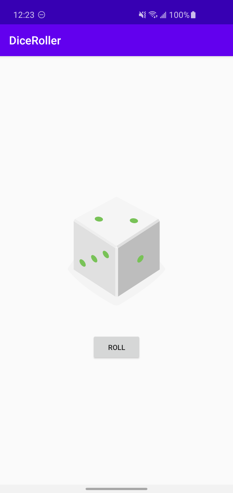

# Dice Roller
A simple Dice Rolling App developed as a part of the [Developing Android Apps with Kotlin](https://www.udacity.com/course/developing-android-apps-with-kotlin--ud9012) course.

# Use case
Users can click on the "Roll" button and the next dice roll appears as an image.

# Screenshots
